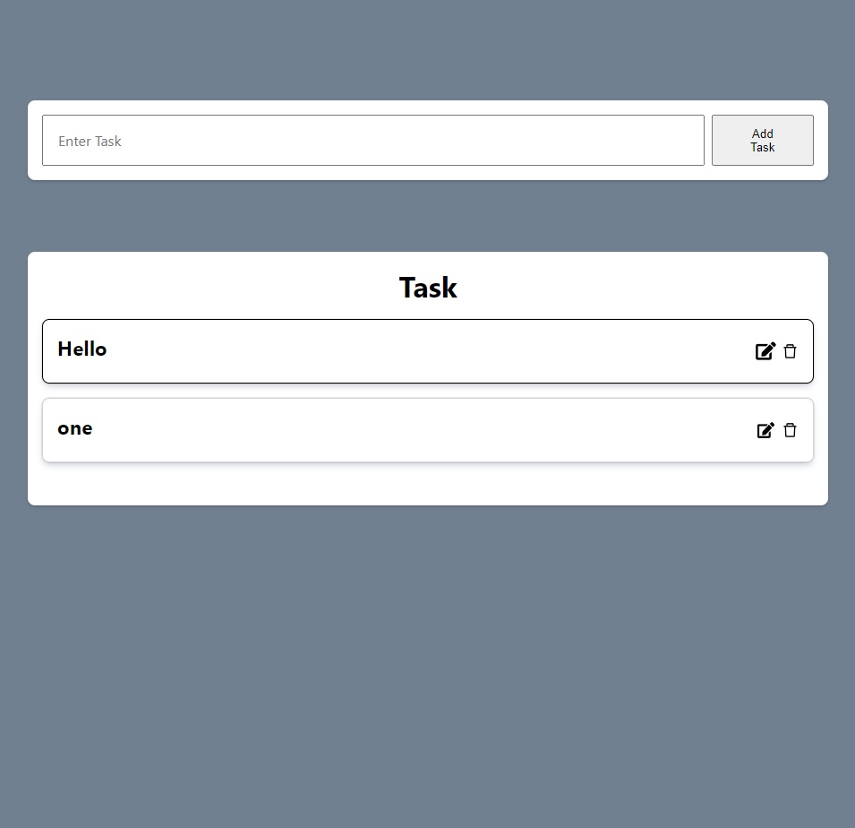
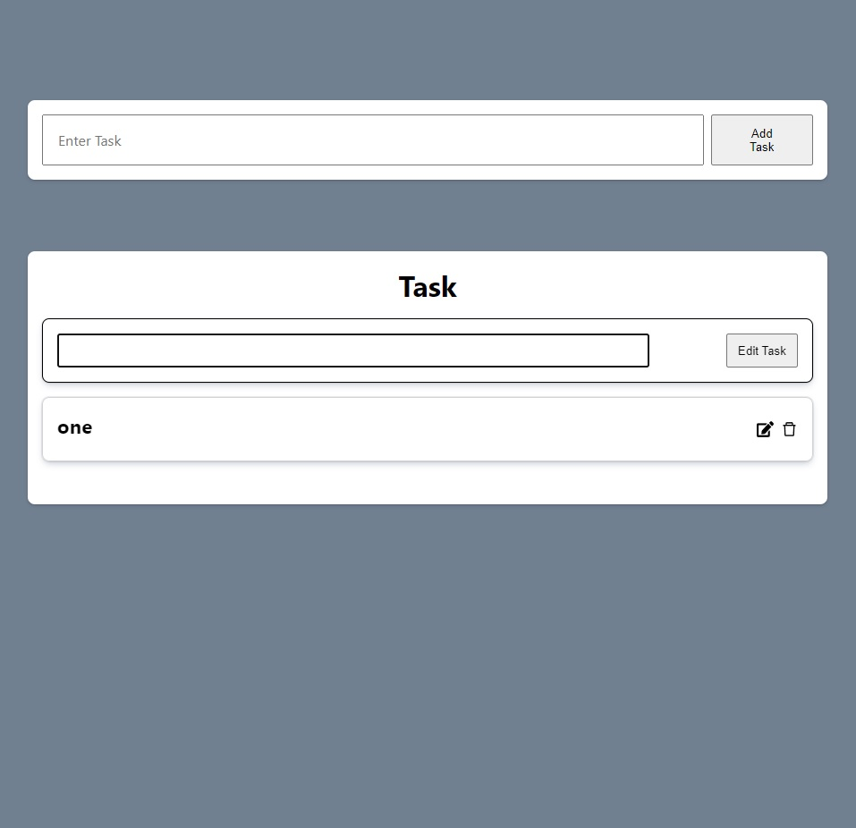

# TheOdinProject - Task List React App

This is a solution to the [Task List React App](https://www.theodinproject.com/lessons/node-path-javascript-handle-inputs-and-render-lists).

## Table of contents

- [Overview](#overview)
  - [The challenge](#the-challenge)
  - [Screenshot](#screenshot)
  - [Links](#links)
- [My process](#my-process)
  - [Built with](#built-with)
  - [What I learned](#what-i-learned)
  - [Continued development](#continued-development)
  - [Useful resources](#useful-resources)
- [Author](#author)


## Overview

### The challenge

Users should be able to:

- Use state and props with React
- Handle inputs with React
- Create render list with React
- Handle events with React
- Implement delete and edit buttons

### Screenshot






### Links

- Solution URL: [https://github.com/Kevo760/Task-List-React-TheOdinProject]
- Live Site URL: [https://Kevo760.github.io/Task-List-React-TheOdinProject/]
## My process

### Built with

- [React](https://reactjs.org/) - JS library

### What I learned

I learned on how to properly pass props and the state through props. I was able to figure out how to pass functions as props and have them to be able to use on child elements with props. I was able to learn how to use useState on functions, which is they have not shown in the curriculum yet. I was having an issue where when I click the edit button it was displaying the input and edit button on all the task instead of just the one that is being clicked. I found out that I was passing the edit state on the app component as a whole. The solution was to use the edit state on the task function that creates the task individually, this allowed me to be able to only have the edit input and edit submit on the task that is being clicked. 


```js
function Task(props) {
    const { task, clickHandler, updateHandler} = props
    const [edit, setEdit] = useState(false)

    function handleEdit() {
      if(edit) {
        setEdit(false)
      } else {
        setEdit(true)
      }
    }


    let viewMode = {}
    let editMode = {
    }
    
    if(edit) {
      viewMode.display = 'none'
    } else {
      editMode.display ='none'
    }
    
  return (
    <div className='task'>
        <h3 style={viewMode}>{task.text}</h3>
        <input
        type='text'
        style={editMode}
        className='edit-input'
        onChange={e => {
          updateHandler(task.id, e.target.value)}}
        />
        <button style={editMode} className='edit-button' onClick={() => handleEdit()}>Edit Task</button>
        <div className='icons' style={viewMode}>
          <FaEdit className='edit icon' onClick={() => handleEdit()}/>
          <AiOutlineDelete className='delete icon'  onClick={() => clickHandler(task.id)}/>
        </div>
    </div>
  )
}

```


### Continued development

I would like to make my coder a lot easier to read. I felt like it was a little hard for me to compare my task list to others via youtube due to me wanting to keep the code layout as the same as TheOdinProject. I was like to practice more on state, specifically on changing the state. 


### Useful resources

- [Stackoverflow](https://www.stackoverflow.com) - This helped me figure out the functionalities of functions with react
- [Brian Design - Youtube](https://www.youtube.com/watch?v=E1E08i2UJGI&t=2410s) - This video helped me understand how state works and how to create a task list


## Author

- Twitter - [@CoderKevo](https://www.twitter.com/CoderKevo)


